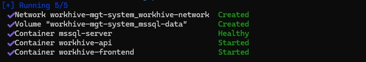
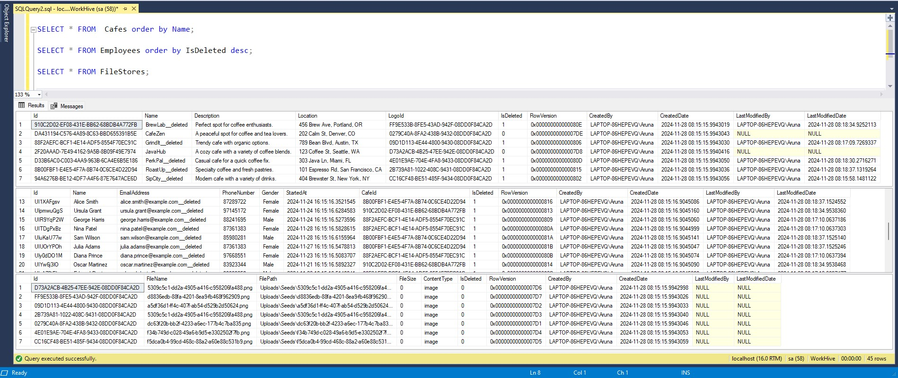
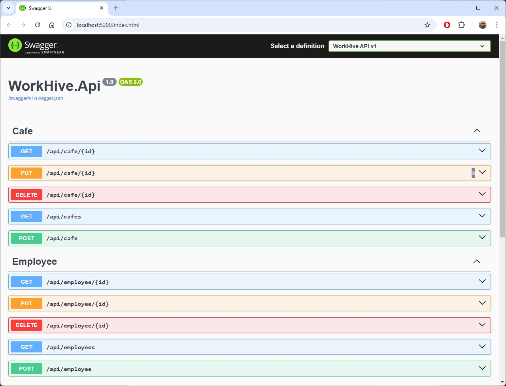
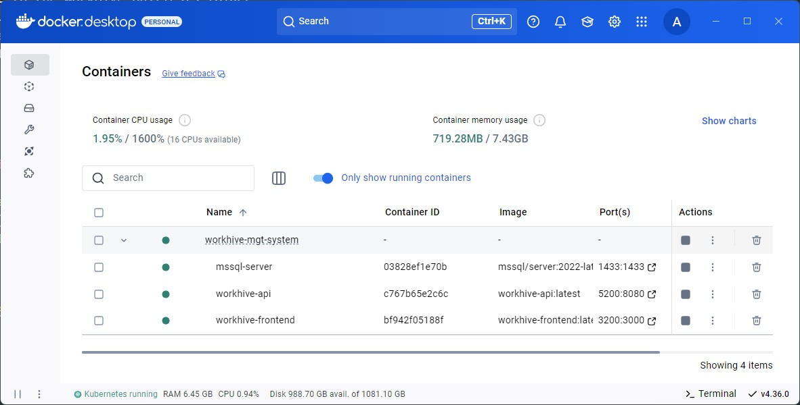
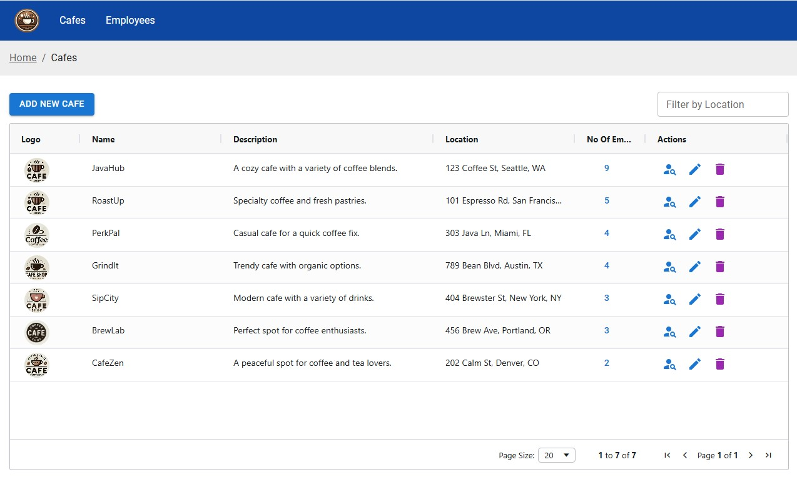
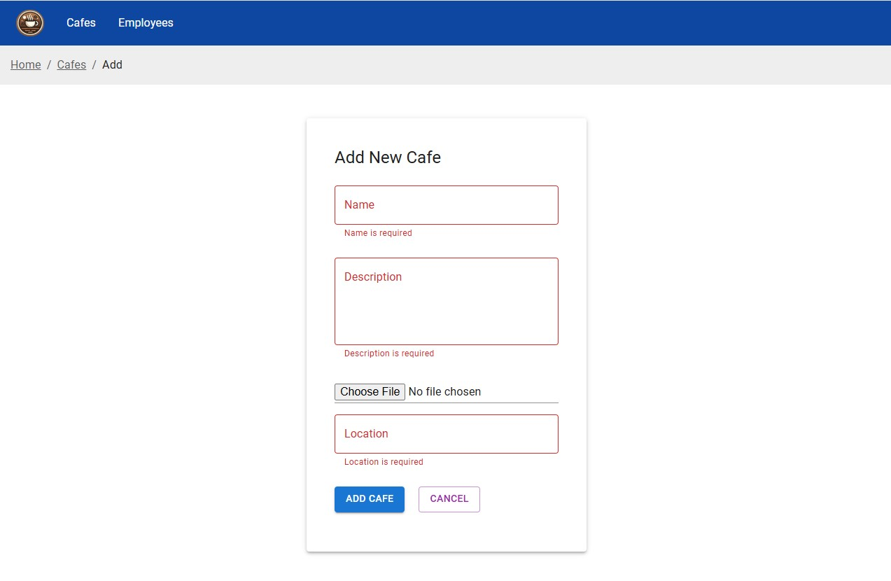
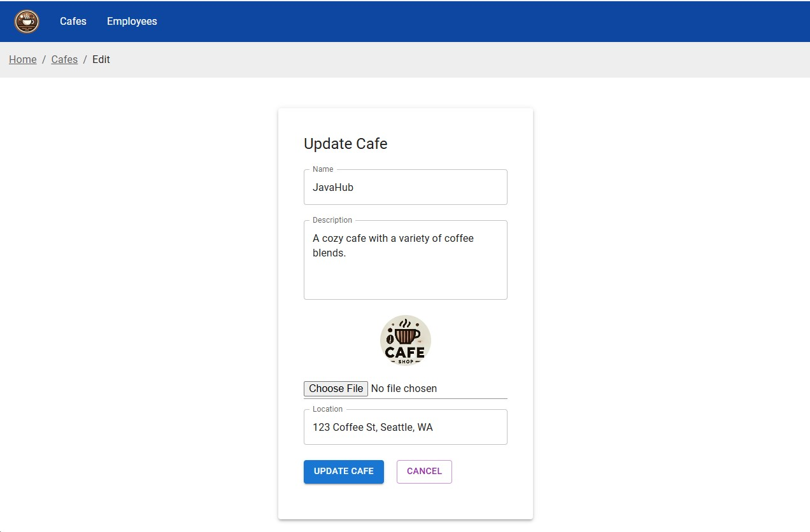
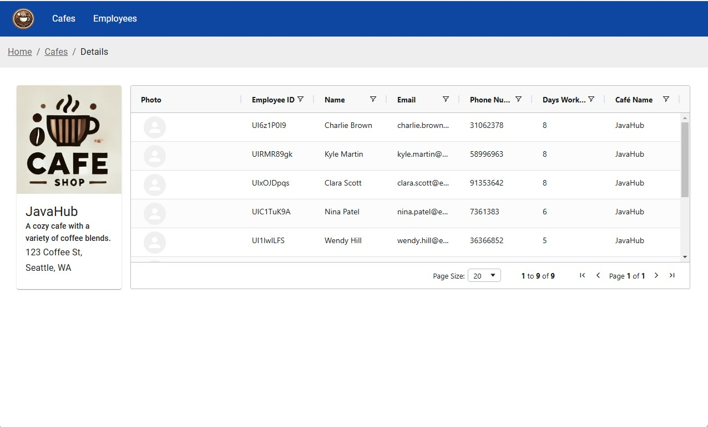
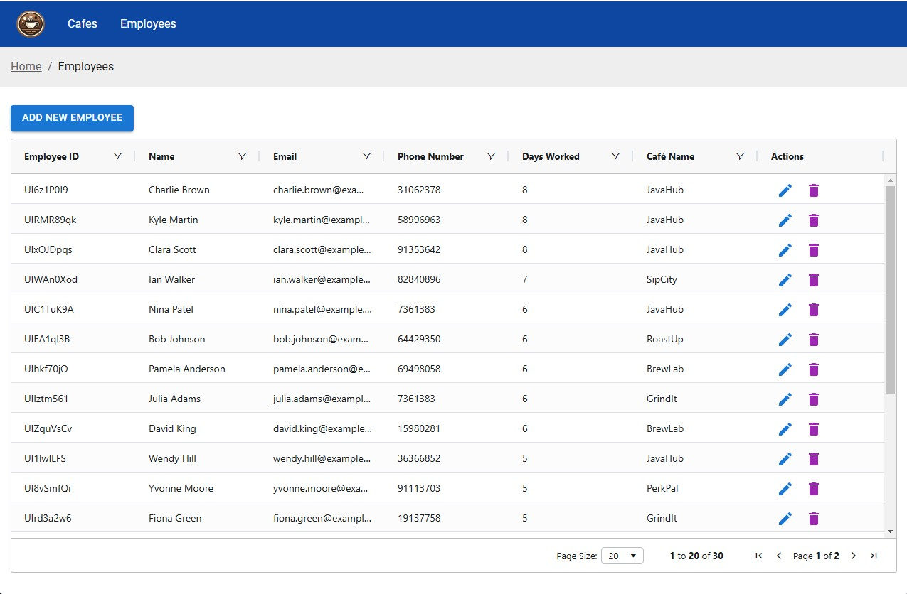

# WorkHive Application

## Overview

This is a Cafe Management Application developed using .NET Core 8 for the backend and React JS for the frontend. The backend handles API requests, processes data, and communicates
with an MSSQL database, while the frontend provides an interactive user interface for managing various operations of the cafe.

---

## Backend

### Technologies:

- **.NET Core 8**: The backend is built using .NET Core 8 for creating a RESTful API.
- **Entity Framework Core 8**: Used for interacting with the MSSQL database, providing a seamless way to manage data.
- **MSSQL Database**: The database used for storing all the necessary data for the cafe application.
- **Docker**: The project is containerized using Docker to ensure consistency and easy deployment.
- **Moq**: Used for unit testing in the backend with `Microsoft.EntityFrameworkCore.InMemory` for simulating the database.
- **FluentValidation**: Used for Api endpoint model validations

## Frontend

### Technologies:

- **React JS**: The frontend is built using React for a dynamic and responsive user interface.
- **React Router**: Used for routing and navigation across the application.
- **Axios**: A promise-based HTTP client used for making API calls to the backend.
- **TanStack Query**: Used for managing queries and mutations, providing an efficient way to fetch and manipulate data.
- **React Data Grid**: Provides advanced data grid functionalities for displaying large sets of tabular data. `ag-grid-react`
- **Material UI**: A React component library for building stylish and responsive UIs with pre-built components.
- **React Hook Form**: A library used for handling forms in React with minimal re-renders and efficient validation. `react-hook-form`

---

## Setup & Installation (docker/docker-compose)

### Prerequisites:

- Docker

### Backend Setup:

1. Clone the repository.
   ```bash
   https://github.com/arunap/WorkHive.git
   ```
2. Navigate to the `WorkHive` folder.
3. Build and Run the Docker container to start the MSSQL database, Frontend, and Backend API:
   ```bash
   docker-compose up -d --build
   ```
4. The Application URLs:
   ```
   frontend: http://localhost:3200/
   backend: http://localhost:5200/index.html
   ```
5. Status:

   <kbd></kbd>

---

## Setup & Installation (Manual)

### Prerequisites:

- Docker
- .NET Core 8 SDK
- Node.js (for frontend)

### Frontend Setup:

1. Navigate to the frontend folder.
2. Install dependencies:
   ```bash
   npm install
   ```
3. Run the React development server:
   ```bash
   npm start
   ```
   ```bash
   http://localhost:3200
   ```

### Backend Setup:

1. Navigate to the WorkHive.Api folder
2. Change the connection string in `appsettings.json` to your local MSSQL Database Server OR MSSQL Docker Image
3. Run the Api Project
   ```bash
     http://localhost:5200/index.html
   ```

---

## Testing

- The backend is equipped with unit tests using **Moq**.
- Navigate to the WorkHive.UnitTests folder
- To run unit tests:
  ```bash
  dotnet test
  ```

---

## Author

**Aruna Nishantha Perea**

- [Website](http://anishantha87.blogspot.com/)
- [Github](https://github.com/arunap)
- [LinkedIn](https://linkedin.com/in/anishantha87)

---

## Appendix

<kbd></kbd>

<kbd></kbd>

<kbd></kbd>

<kbd></kbd>

<kbd></kbd>

<kbd></kbd>

<kbd></kbd>

<kbd></kbd>

---

## License

This project is licensed under the MIT License - see the [LICENSE](LICENSE) file for details.
